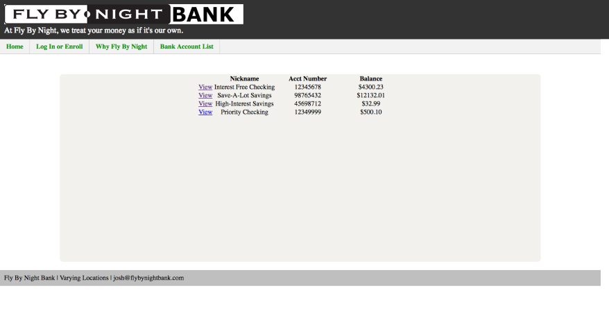
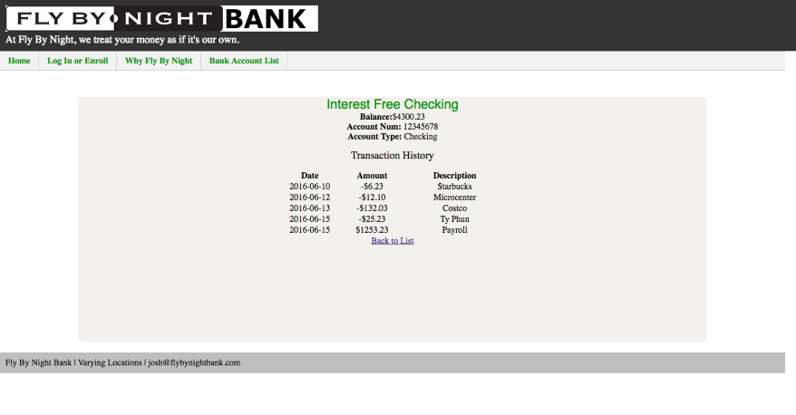
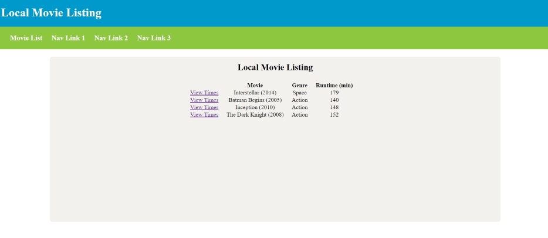
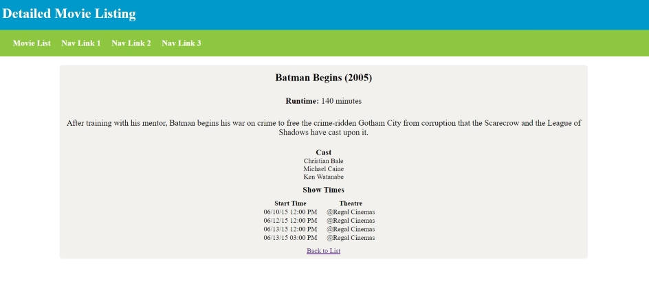

# Fly By Night Bank

Using the concepts learned in today's class you will be developing a three page web application that displays
the Fly By Night Banking home page, a list of your accounts, and a detailed transaction view for a particular account.

* All pages must have a consistent look and feel with minimal duplicate code (**Hint: use page includes**). 
    * The JSPs that have been included contain a lot of code duplication.  You will need to modify these to eliminate this.
   
* One view lists all of the available bank accounts with their name, balance, and account number. The url for your view is `http://localhost/fly-by-night-web/accountList`

* The *View* link is dynamically generated. Clicking on it, takes the user to a Bank Account Detail page for that specific bank account.
    * This view includes the transaction history for the bank account obect.
    * The url for this view is `http://localhost/fly-by-night-web/accountDetail?accountId={id}` where `{id}` is the id of the bank account to display 

** Bonus **

Customize the layout further

# Movie Show Times

Using the concepts learned in today's class you will be developing a two page web application that displays
a listing of movies and available showtimes.

* All pages must have a consistent look and feel with minimal duplicate code (**Hint: use page includes**). 
    * The JSPs that have been included contain a lot of code duplication.  You will need to modify these to eliminate this.

* One view lists all of the available movies. The url for your view is `http://localhost/movie-web/movieList`    

* Clicking on the *View Times* link takes the user to a View Detail page for that specfic movie. 
    * This view includes the cast members and showtimes for the current movie. 
    * The url for this view is `http://localhost/movie-web/movieDetail?movieId={id}` where `{id}` is the id of the movie to display.

** Bonus **

Customize the layout of the detailed movie listing. Find movie posters online and display them on the detail page with your content. 